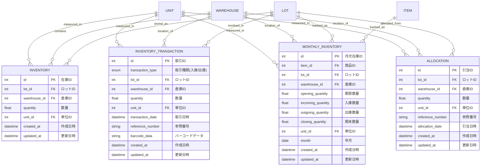

# データモデル設計

## 1. マスタデータ

## 2. トランザクションデータ

## 3. テーブル定義

### マスタテーブル

#### ITEM（商品マスタ）
| フィールド名 | データ型 | 説明 | 制約 |
|------------|---------|------|------|
| id | INTEGER | 商品ID | PRIMARY KEY, AUTOINCREMENT |
| code | TEXT | 商品コード | UNIQUE, NOT NULL |
| name | TEXT | 商品名 | NOT NULL |
| description | TEXT | 説明 | NULL許容 |
| item_type | TEXT | 種類(製造品/社外品/原材料) | NOT NULL |
| created_at | DATETIME | 作成日時 | NOT NULL, DEFAULT CURRENT_TIMESTAMP |
| updated_at | DATETIME | 更新日時 | NOT NULL |

#### UNIT（単位マスタ）
| フィールド名 | データ型 | 説明 | 制約 |
|------------|---------|------|------|
| id | INTEGER | 単位ID | PRIMARY KEY, AUTOINCREMENT |
| name | TEXT | 単位名(個/kg/ロットなど) | UNIQUE, NOT NULL |
| description | TEXT | 説明 | NULL許容 |
| created_at | DATETIME | 作成日時 | NOT NULL, DEFAULT CURRENT_TIMESTAMP |
| updated_at | DATETIME | 更新日時 | NOT NULL |

#### ITEM_UNIT（商品単位マッピング）
| フィールド名 | データ型 | 説明 | 制約 |
|------------|---------|------|------|
| id | INTEGER | 商品単位ID | PRIMARY KEY, AUTOINCREMENT |
| item_id | INTEGER | 商品ID | NOT NULL, FOREIGN KEY |
| unit_id | INTEGER | 単位ID | NOT NULL, FOREIGN KEY |
| conversion_rate | REAL | 換算率 | NOT NULL, DEFAULT 1.0 |
| is_default | BOOLEAN | デフォルト単位フラグ | NOT NULL, DEFAULT FALSE |
| created_at | DATETIME | 作成日時 | NOT NULL, DEFAULT CURRENT_TIMESTAMP |
| updated_at | DATETIME | 更新日時 | NOT NULL |

#### WAREHOUSE（倉庫マスタ）
| フィールド名 | データ型 | 説明 | 制約 |
|------------|---------|------|------|
| id | INTEGER | 倉庫ID | PRIMARY KEY, AUTOINCREMENT |
| code | TEXT | 倉庫コード | UNIQUE, NOT NULL |
| name | TEXT | 倉庫名 | NOT NULL |
| description | TEXT | 説明 | NULL許容 |
| created_at | DATETIME | 作成日時 | NOT NULL, DEFAULT CURRENT_TIMESTAMP |
| updated_at | DATETIME | 更新日時 | NOT NULL |

#### LOT（ロットマスタ）
| フィールド名 | データ型 | 説明 | 制約 |
|------------|---------|------|------|
| id | INTEGER | ロットID | PRIMARY KEY, AUTOINCREMENT |
| lot_number | TEXT | ロット番号 | UNIQUE, NOT NULL |
| item_id | INTEGER | 商品ID | NOT NULL, FOREIGN KEY |
| production_date | DATE | 製造日/入荷日 | NOT NULL |
| created_at | DATETIME | 作成日時 | NOT NULL, DEFAULT CURRENT_TIMESTAMP |
| updated_at | DATETIME | 更新日時 | NOT NULL |

### トランザクションテーブル

#### INVENTORY（在庫）
| フィールド名 | データ型 | 説明 | 制約 |
|------------|---------|------|------|
| id | INTEGER | 在庫ID | PRIMARY KEY, AUTOINCREMENT |
| lot_id | INTEGER | ロットID | NOT NULL, FOREIGN KEY |
| warehouse_id | INTEGER | 倉庫ID | NOT NULL, FOREIGN KEY |
| quantity | REAL | 数量 | NOT NULL |
| unit_id | INTEGER | 単位ID | NOT NULL, FOREIGN KEY |
| created_at | DATETIME | 作成日時 | NOT NULL, DEFAULT CURRENT_TIMESTAMP |
| updated_at | DATETIME | 更新日時 | NOT NULL |

#### INVENTORY_TRANSACTION（入出庫）
| フィールド名 | データ型 | 説明 | 制約 |
|------------|---------|------|------|
| id | INTEGER | 取引ID | PRIMARY KEY, AUTOINCREMENT |
| transaction_type | TEXT | 取引種類(入庫/出庫) | NOT NULL |
| lot_id | INTEGER | ロットID | NOT NULL, FOREIGN KEY |
| warehouse_id | INTEGER | 倉庫ID | NOT NULL, FOREIGN KEY |
| quantity | REAL | 数量 | NOT NULL |
| unit_id | INTEGER | 単位ID | NOT NULL, FOREIGN KEY |
| transaction_date | DATETIME | 取引日時 | NOT NULL |
| reference_number | TEXT | 参照番号 | NULL許容 |
| barcode_data | TEXT | バーコードデータ | NULL許容 |
| created_at | DATETIME | 作成日時 | NOT NULL, DEFAULT CURRENT_TIMESTAMP |
| updated_at | DATETIME | 更新日時 | NOT NULL |

#### MONTHLY_INVENTORY（月次在庫）
| フィールド名 | データ型 | 説明 | 制約 |
|------------|---------|------|------|
| id | INTEGER | 月次在庫ID | PRIMARY KEY, AUTOINCREMENT |
| item_id | INTEGER | 商品ID | NOT NULL, FOREIGN KEY |
| lot_id | INTEGER | ロットID | NOT NULL, FOREIGN KEY |
| warehouse_id | INTEGER | 倉庫ID | NOT NULL, FOREIGN KEY |
| opening_quantity | REAL | 期首数量 | NOT NULL |
| incoming_quantity | REAL | 入庫数量 | NOT NULL |
| outgoing_quantity | REAL | 出庫数量 | NOT NULL |
| closing_quantity | REAL | 期末数量 | NOT NULL |
| unit_id | INTEGER | 単位ID | NOT NULL, FOREIGN KEY |
| month | DATE | 年月 | NOT NULL |
| created_at | DATETIME | 作成日時 | NOT NULL, DEFAULT CURRENT_TIMESTAMP |
| updated_at | DATETIME | 更新日時 | NOT NULL |

#### ALLOCATION（引当）
| フィールド名 | データ型 | 説明 | 制約 |
|------------|---------|------|------|
| id | INTEGER | 引当ID | PRIMARY KEY, AUTOINCREMENT |
| lot_id | INTEGER | ロットID | NOT NULL, FOREIGN KEY |
| warehouse_id | INTEGER | 倉庫ID | NOT NULL, FOREIGN KEY |
| quantity | REAL | 数量 | NOT NULL |
| unit_id | INTEGER | 単位ID | NOT NULL, FOREIGN KEY |
| reference_number | TEXT | 参照番号 | NULL許容 |
| allocation_date | DATETIME | 引当日時 | NOT NULL |
| created_at | DATETIME | 作成日時 | NOT NULL, DEFAULT CURRENT_TIMESTAMP |
| updated_at | DATETIME | 更新日時 | NOT NULL |