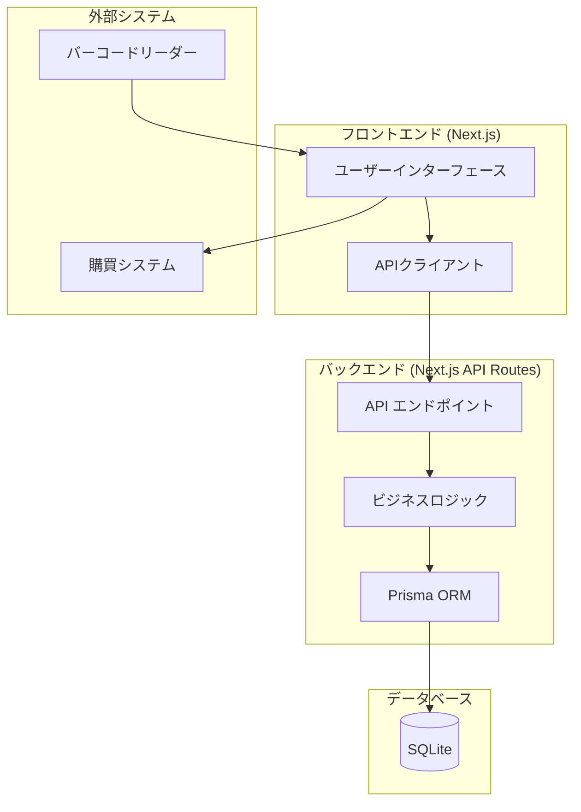

# 在庫管理システム設計計画

## 1. システム概要

中規模企業向けの在庫管理システムで、購買部門が主に利用します。製造品、社外品、原材料の在庫をロット番号と倉庫単位で管理し、バーコードを使用した入出庫処理を行います。

## 2. システムアーキテクチャ



## 3. 技術スタック

- **フロントエンド**
  - React (Next.js)
  - CSS Modules / Tailwind CSS

- **バックエンド**
  - Next.js (サーバーサイド)
  - Prisma ORM

- **データベース**
  - SQLite (MVPを軽量で作成し、ローカルで動作させるため)

## 4. 画面設計

### 主要画面一覧
1. ダッシュボード
2. 商品マスタ管理画面
3. 単位マスタ管理画面
4. 倉庫マスタ管理画面
5. 在庫照会画面
6. 入庫登録画面
7. 出庫登録画面
8. 入出庫履歴照会画面
9. 月次在庫照会画面
10. 棚卸し画面
11. 在庫引当画面
12. 引当状況照会画面
13. レポート出力画面

### 画面遷移図

```mermaid
flowchart TD
    LOGIN[ログイン] --> DASHBOARD[ダッシュボード]

    DASHBOARD --> MASTER[マスタ管理]
    DASHBOARD --> INVENTORY[在庫管理]
    DASHBOARD --> TRANSACTION[入出庫管理]
    DASHBOARD --> MONTHLY[月次在庫]
    DASHBOARD --> ALLOCATION[在庫引当]
    DASHBOARD --> REPORT[レポート]

    MASTER --> ITEM_MASTER[商品マスタ]
    MASTER --> UNIT_MASTER[単位マスタ]
    MASTER --> WAREHOUSE_MASTER[倉庫マスタ]

    INVENTORY --> INVENTORY_LIST[在庫一覧]
    INVENTORY --> INVENTORY_DETAIL[在庫詳細]

    TRANSACTION --> INBOUND[入庫登録]
    TRANSACTION --> OUTBOUND[出庫登録]
    TRANSACTION --> TRANSACTION_HISTORY[入出庫履歴]

    MONTHLY --> MONTHLY_LIST[月次在庫一覧]
    MONTHLY --> STOCKTAKING[棚卸し]

    ALLOCATION --> ALLOCATION_REGISTER[引当登録]
    ALLOCATION --> ALLOCATION_LIST[引当一覧]

    REPORT --> INVENTORY_REPORT[在庫一覧レポート]
    REPORT --> MONTHLY_REPORT[在庫推移レポート]