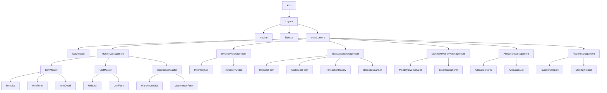

# 技術設計

## 1. API設計

### RESTful API エンドポイント

#### 商品関連
- GET /api/items - 商品一覧取得
- GET /api/items/:id - 商品詳細取得
- POST /api/items - 商品登録
- PUT /api/items/:id - 商品更新
- DELETE /api/items/:id - 商品削除

#### 単位関連
- GET /api/units - 単位一覧取得
- GET /api/units/:id - 単位詳細取得
- POST /api/units - 単位登録
- PUT /api/units/:id - 単位更新
- DELETE /api/units/:id - 単位削除

#### 倉庫関連
- GET /api/warehouses - 倉庫一覧取得
- GET /api/warehouses/:id - 倉庫詳細取得
- POST /api/warehouses - 倉庫登録
- PUT /api/warehouses/:id - 倉庫更新
- DELETE /api/warehouses/:id - 倉庫削除

#### ロット関連
- GET /api/lots - ロット一覧取得
- GET /api/lots/:id - ロット詳細取得
- POST /api/lots - ロット登録
- PUT /api/lots/:id - ロット更新
- DELETE /api/lots/:id - ロット削除

#### 在庫関連
- GET /api/inventory - 在庫一覧取得
- GET /api/inventory/item/:itemId - 商品別在庫取得
- GET /api/inventory/warehouse/:warehouseId - 倉庫別在庫取得
- GET /api/inventory/lot/:lotId - ロット別在庫取得

#### 入出庫関連
- POST /api/transactions/inbound - 入庫登録
- POST /api/transactions/outbound - 出庫登録
- GET /api/transactions - 入出庫履歴取得
- GET /api/transactions/:id - 入出庫詳細取得

#### 月次在庫関連
- GET /api/monthly-inventory - 月次在庫一覧取得
- GET /api/monthly-inventory/:year/:month - 指定月の在庫取得
- POST /api/monthly-inventory/calculate/:year/:month - 月次在庫計算

#### 在庫引当関連
- POST /api/allocations - 引当登録
- GET /api/allocations - 引当一覧取得
- GET /api/allocations/:id - 引当詳細取得
- DELETE /api/allocations/:id - 引当解除

#### レポート関連
- GET /api/reports/inventory - 在庫一覧レポート取得
- GET /api/reports/monthly/:year/:month - 在庫推移レポート取得

## 2. データベース設計（Prisma Schema）

```prisma
// This is your Prisma schema file

generator client {
  provider = "prisma-client-js"
}

datasource db {
  provider = "sqlite"
  url      = "file:./dev.db"
}

// 商品マスタ
model Item {
  id          Int       @id @default(autoincrement())
  code        String    @unique
  name        String
  description String?
  itemType    ItemType
  createdAt   DateTime  @default(now())
  updatedAt   DateTime  @updatedAt

  // リレーション
  itemUnits        ItemUnit[]
  lots             Lot[]
  monthlyInventory MonthlyInventory[]
}

// 単位マスタ
model Unit {
  id          Int       @id @default(autoincrement())
  name        String    @unique
  description String?
  createdAt   DateTime  @default(now())
  updatedAt   DateTime  @updatedAt

  // リレーション
  itemUnits            ItemUnit[]
  inventory            Inventory[]
  inventoryTransaction InventoryTransaction[]
  monthlyInventory     MonthlyInventory[]
  allocation           Allocation[]
}

// 商品単位マッピング
model ItemUnit {
  id             Int      @id @default(autoincrement())
  itemId         Int
  unitId         Int
  conversionRate Float    @default(1.0)
  isDefault      Boolean  @default(false)
  createdAt      DateTime @default(now())
  updatedAt      DateTime @updatedAt

  // リレーション
  item Item @relation(fields: [itemId], references: [id])
  unit Unit @relation(fields: [unitId], references: [id])

  @@unique([itemId, unitId])
}

// 倉庫マスタ
model Warehouse {
  id          Int       @id @default(autoincrement())
  code        String    @unique
  name        String
  description String?
  createdAt   DateTime  @default(now())
  updatedAt   DateTime  @updatedAt

  // リレーション
  inventory            Inventory[]
  inventoryTransaction InventoryTransaction[]
  monthlyInventory     MonthlyInventory[]
  allocation           Allocation[]
}

// ロットマスタ
model Lot {
  id             Int       @id @default(autoincrement())
  lotNumber      String    @unique
  itemId         Int
  productionDate DateTime
  createdAt      DateTime  @default(now())
  updatedAt      DateTime  @updatedAt

  // リレーション
  item                 Item                  @relation(fields: [itemId], references: [id])
  inventory            Inventory[]
  inventoryTransaction InventoryTransaction[]
  monthlyInventory     MonthlyInventory[]
  allocation           Allocation[]
}

// 在庫
model Inventory {
  id          Int      @id @default(autoincrement())
  lotId       Int
  warehouseId Int
  quantity    Float
  unitId      Int
  createdAt   DateTime @default(now())
  updatedAt   DateTime @updatedAt

  // リレーション
  lot       Lot       @relation(fields: [lotId], references: [id])
  warehouse Warehouse @relation(fields: [warehouseId], references: [id])
  unit      Unit      @relation(fields: [unitId], references: [id])

  @@unique([lotId, warehouseId, unitId])
}

// 入出庫トランザクション
model InventoryTransaction {
  id              Int              @id @default(autoincrement())
  transactionType TransactionType
  lotId           Int
  warehouseId     Int
  quantity        Float
  unitId          Int
  transactionDate DateTime
  referenceNumber String?
  barcodeData     String?
  createdAt       DateTime         @default(now())
  updatedAt       DateTime         @updatedAt

  // リレーション
  lot       Lot       @relation(fields: [lotId], references: [id])
  warehouse Warehouse @relation(fields: [warehouseId], references: [id])
  unit      Unit      @relation(fields: [unitId], references: [id])
}

// 月次在庫
model MonthlyInventory {
  id               Int      @id @default(autoincrement())
  itemId           Int
  lotId            Int
  warehouseId      Int
  openingQuantity  Float
  incomingQuantity Float
  outgoingQuantity Float
  closingQuantity  Float
  unitId           Int
  month            DateTime
  createdAt        DateTime @default(now())
  updatedAt        DateTime @updatedAt

  // リレーション
  item      Item      @relation(fields: [itemId], references: [id])
  lot       Lot       @relation(fields: [lotId], references: [id])
  warehouse Warehouse @relation(fields: [warehouseId], references: [id])
  unit      Unit      @relation(fields: [unitId], references: [id])

  @@unique([itemId, lotId, warehouseId, unitId, month])
}

// 在庫引当
model Allocation {
  id             Int      @id @default(autoincrement())
  lotId          Int
  warehouseId    Int
  quantity       Float
  unitId         Int
  referenceNumber String?
  allocationDate DateTime
  createdAt      DateTime @default(now())
  updatedAt      DateTime @updatedAt

  // リレーション
  lot       Lot       @relation(fields: [lotId], references: [id])
  warehouse Warehouse @relation(fields: [warehouseId], references: [id])
  unit      Unit      @relation(fields: [unitId], references: [id])
}

// 列挙型
enum ItemType {
  MANUFACTURED // 製造品
  EXTERNAL     // 社外品
  RAW_MATERIAL // 原材料
}

enum TransactionType {
  INBOUND  // 入庫
  OUTBOUND // 出庫
}
```

## 3. フロントエンド設計

### コンポーネント構成



### 状態管理

Next.jsのサーバーコンポーネントとクライアントコンポーネントを適切に組み合わせて使用します。

- サーバーコンポーネント：データフェッチングやレンダリングが主な役割のコンポーネント
- クライアントコンポーネント：インタラクティブな要素を含むコンポーネント

クライアントサイドの状態管理には、React Hooksを使用します：
- `useState`：コンポーネントローカルの状態管理
- `useReducer`：複雑な状態ロジックの管理
- `useContext`：グローバル状態の共有

## 4. バックエンド設計

### ディレクトリ構造

```
/app
  /api
    /items
      /route.js
      /[id]/route.js
    /units
      /route.js
      /[id]/route.js
    /warehouses
      /route.js
      /[id]/route.js
    /lots
      /route.js
      /[id]/route.js
    /inventory
      /route.js
      /item/[itemId]/route.js
      /warehouse/[warehouseId]/route.js
      /lot/[lotId]/route.js
    /transactions
      /route.js
      /[id]/route.js
      /inbound/route.js
      /outbound/route.js
    /monthly-inventory
      /route.js
      /[year]/[month]/route.js
      /calculate/[year]/[month]/route.js
    /allocations
      /route.js
      /[id]/route.js
    /reports
      /inventory/route.js
      /monthly/[year]/[month]/route.js
  /lib
    /prisma.js
    /utils.js
  /models
    /item.js
    /unit.js
    /warehouse.js
    /lot.js
    /inventory.js
    /transaction.js
    /monthlyInventory.js
    /allocation.js
```

### ミドルウェア

- 認証ミドルウェア：ユーザー認証の処理
- エラーハンドリングミドルウェア：APIエラーの統一的な処理
- ロギングミドルウェア：APIリクエスト/レスポンスのログ記録

## 5. セキュリティ設計

- 入力バリデーション：すべてのユーザー入力に対する検証
- SQLインジェクション対策：Prisma ORMによるパラメータ化クエリの使用
- XSS対策：適切なエスケープ処理
- CSRF対策：トークンベースの保護
- 認証・認可：ロールベースのアクセス制御

## 6. パフォーマンス最適化

- データベースインデックス：頻繁に検索されるフィールドにインデックスを設定
- クエリ最適化：N+1問題の回避
- キャッシング：頻繁にアクセスされるデータのキャッシュ
- ページネーション：大量データの分割取得
- 遅延ローディング：必要なときにのみデータをロード